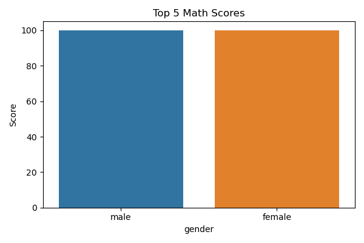
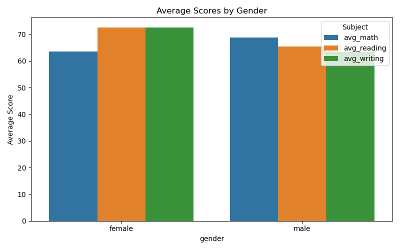
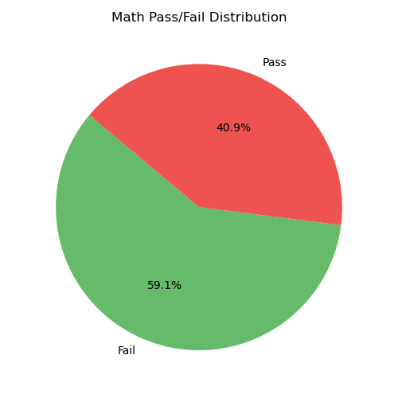

# 🧮 Student Performance Tracker

This project analyzes and visualizes student exam scores using Python, SQLite, and data visualizations with Matplotlib & Seaborn.

## 📊 Features

- Loads a real-world CSV dataset of student scores
- Stores cleaned data in an SQLite database
- Runs SQL queries (Top scores, Averages, Pass/Fail)
- Exports insights to a summary text file
- Visualizes results with bar and pie charts

## 📂 Files Included

- `student_performance.py` - Main Python script
- `StudentsPerformance.csv` - Dataset
- `summary.txt` - Exported SQL results
- `top_5_math_scores.png` - Bar chart of top scorers
- `avg_scores_by_gender.png` - Grouped bar chart of averages
- `pass_fail_pie.png` - Pie chart for pass/fail

## 📷 Visual Examples

### Top 5 Math Scores


### Average Scores by Gender


### Pass/Fail Distribution


## 💡 Technologies Used

- Python
- SQLite3
- Matplotlib
- Seaborn
- Pandas

## 🚀 How to Run

```bash
pip install pandas matplotlib seaborn
python student_performance.py
